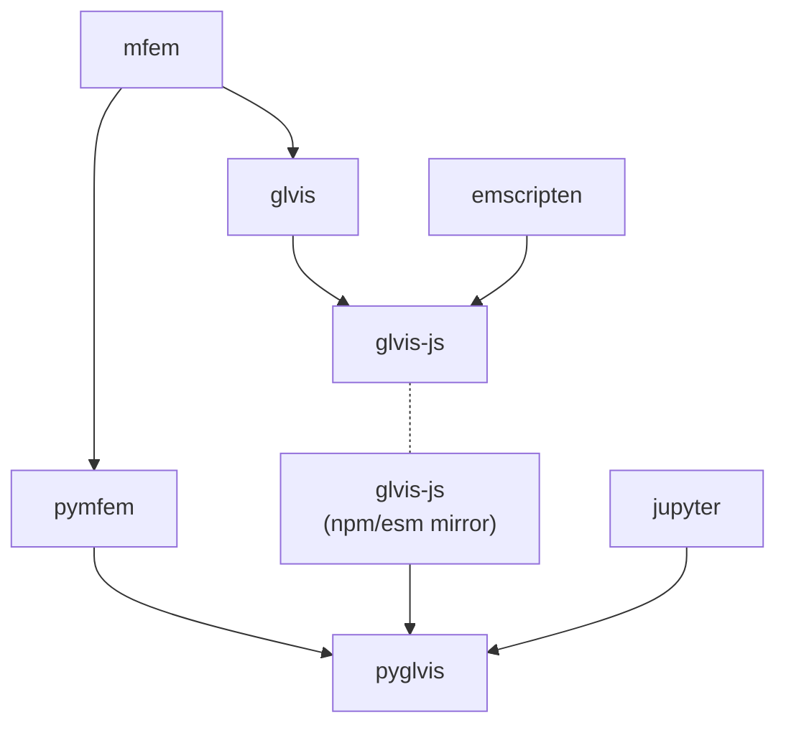

# PyGLVis

<!-- Badges generated at https://mybinder.readthedocs.io/en/latest/howto/badges.html -->
[](https://mybinder.org/v2/gh/GLVis/pyglvis/HEAD?filepath=examples%2Fbasic.ipynb)
[](https://mybinder.org/v2/gh/GLVis/pyglvis/HEAD?filepath=examples%2Fplot.ipynb)
[](https://mybinder.org/v2/gh/GLVis/pyglvis/HEAD?filepath=examples%2Fex1.ipynb)
[](https://mybinder.org/v2/gh/GLVis/pyglvis/HEAD?filepath=examples%2Fex9.ipynb)

PyGLVis is an interactive [Jupyter](https://jupyter.org/) widget for visualizing finite element meshes and functions, built on-top of the [GLVis](https://glvis.org/) library.

## 📦 Installation

The GLVis Jupyter widget is installed using `pip`. To install the latest version from the repository:

```bash
git clone https://github.com/GLVis/pyglvis.git
cd pyglvis
pip install .
```

Or, install directly from PyPi,
```bash
pip install glvis
```

PyGLVis requires the Python wrapper for MFEM, [PyMFEM](https://github.com/mfem/pymfem), which can be installed with
```bash
pip install mfem
```


## 🚀 Usage

### Basic usage

```python
from glvis import glvis

# Create a `glvis` object
g = glvis(data, width=640, height=480)

# Run a cell with `g` as the last statement to display the widget
g
```

The `data` object can be one of:

- `Mesh`, defined in [PyMFEM](https://github.com/mfem/pymfem)
- `(Mesh, GridFunction)` tuple, defined in [PyMFEM](https://github.com/mfem/pymfem)
- `str`, in the format of `*.saved` files [used by MFEM and GLVis](https://mfem.org/mesh-format-v1.0/). See [examples/basic.ipynb](examples/basic.ipynb) for an example.

### Customization with key commands

GLVis has many keyboard commands that can be used to customize the visualization.
A few of the most common are listed below. See the [GLVis README](https://github.com/GLVis/glvis?tab=readme-ov-file#key-commands) for a full list.
 - `r` - reset the view
 - `c` - toggle the colorbar
 - `j` - toggle perspective
 - `l` - toggle the light
 - `g` - toggle the background color (white/black)
 - `a` - cycle through bounding box axes states
 - `m` - cycle through mesh states
 - `p` - cycle through color palettes
 - `t` - cycle through materials and lights
 - `0` - begin rotating around z-axis
 - `.` - pause rotation
 - `*`/`/` - zoom in/out

These can be set using the `keys` argument when creating a `glvis` object.
```python
glvis(data, keys='rljgac//0')
```
This combination of keys would: `r` reset the view, `l` toggle the light, `j` toggle perspective, `g` toggle the background color to black (default is white), `a` show the bounding box, `c` show the colorbar, `//` zoom out twice, and `0` begin rotating around the z-axis:


Alternatively, keys can be typed directly into the widget after it has been created:


### Other methods

Once you have a `glvis` object there are a few methods that can used to update the
visualization, besides using keys:
```python
# Show a new Mesh/GridFunction, resets keys
g.plot(data)
# Show an updated visualization with the same data, preserving keys
g.update(data)
# Change the image size
g.set_size(width, height)
# Force the widget to render. If the widget isn't the last statement in a cell it
# will not be shown without this. See ex9.ipynb
g.render()
```

See the [examples](examples/) directory for additional examples. To test those locally, start a Jupyter lab server with

```
jupyter lab
```

## 🐛 Troubleshooting

This widget was originally developed using the [jupyter widget cookiecutter](https://github.com/jupyter-widgets/widget-cookiecutter); however, [recent changes to the Jupyter ecosystem](https://jupyter-notebook.readthedocs.io/en/latest/migrate_to_notebook7.html#why-a-new-version) have broken a lot of functionality, leading to a rewrite using [anywidget](https://anywidget.dev/). If you encounter any problems, please consider supporting development by opening an [issue](https://github.com/GLVis/pyglvis/issues).


## 🤖 Development

### PyGLVis dependencies



`pyglvis` is most directly depednent on `PyMFEM` and `glvis-js`. [PyMFEM](https://github.com/mfem/pymfem) is a Python wrapper of the finite element library, `MFEM`, while `glvis-js` is a JavaScript/WebAssembly port of `glvis`.

`glvis-js` is hosted on [github](https://github.com/glvis/glvis-js) and mirrored on [npm](https://www.npmjs.com/package/glvis). [esm.sh](https://esm.sh/glvis) allows `pyglvis` to pull the latest version of `glvis-js` directly from npm. This can be seen in the first line of [glvis/widget.js](glvis/widget.js):

```
import glvis from "https://esm.sh/glvis";
```

You can specify a different version of `glvis-js` by adding `@x.y.z` to the end of this import statement, where `x.y.z` matches a version number available on `npm`, e.g.

```
import glvis from "https://esm.sh/glvis@0.6.3";
```


### Releasing a new version of glvis on NPM:

To publish a new version of `glvis-js`, follow the instructions on the [repo](https://github.com/GLVis/glvis-js/tree/master).


### Releasing a new version of glvis on PyPI:

- Update `__version__` in `glvis/__about__.py`

- `git add` and `git commit` changes


You will need [twine](https://pypi.org/project/twine/) to publish to PyPI, install with `pip`.

```
python setup.py sdist bdist_wheel
twine upload dist/*
git tag -a X.X.X -m 'comment'
git push --tags
```


## 🌐 Links
- MFEM ([website](https://mfem.org/), [github](https://github.com/mfem/mfem))
- PyMFEM ([github](https://github.com/mfem/pymfem), [pypi](https://pypi.org/project/mfem/))
- GLVis ([website](https://glvis.org/), [github](https://github.com/glvis/glvis))
- glvis-js ([github](https://github.com/glvis/glvis-js), [npm](https://www.npmjs.com/package/glvis), [esm](https://esm.sh/glvis))
- pyglvis ([github](https://github.com/GLVis/pyglvis), [pypi]())
